# OpenFlowKit

A free, local-first, agent-native infinite canvas for technical diagrams. It **feels**
like FigJam, **thinks** like Koboyo — text is the hub, the canvas is a view of it — and
is driven by agents (MCP and BYOK) better than either.

[](https://github.com/Vrun-design/openflowkit/actions/workflows/quality.yml)
[](LICENSE)

- **Canvas that keeps up.** Pixi/WebGL renderer, zoom-to-cursor, connectors that bind to
  sides and never leave a stale route, one undo step per intent.
- **Diagram as code.** Eight families — flowchart, architecture, sequence, state, ERD,
  class, gitgraph, mindmap — behind one forgiving line-oriented DSL, with a deterministic
  serializer: `serialize(parse(text)) == text`.
- **Agents are first-class.** An MCP server drives the *live* editor through a local
  bridge, or works on `.openflow.json` files. Bring your own key for generation inside
  the app. No account, no cloud, no telemetry.

## The 30 seconds that explain it

```
flowchart
  Client [blue] -> "API Gateway" [emerald] : HTTPS
  "API Gateway" -> Queue [queue, amber]
  Queue -> Worker
  Worker -> Store [cylinder, red, bold]
```

1. Press <kbd>⌥D</kbd>, paste that, press <kbd>⌘↵</kbd> — a real diagram lands as one frame.
2. Drag a node: the code does not change, and the panel says *Canvas edited*.
3. Press <kbd>⌘↵</kbd> again: the frame is replaced from the text, one undo step.
4. Click **Connect agent**, ask your MCP client for `create_diagram` — the same thing
   happens while you watch.
5. Export PNG (2×), SVG, PDF, JSON or an animation (animated SVG, GIF, MP4, WebM);
   switch the palette to `paper`, `builder` or `mono` and regenerate.

## Run it

```bash
npm install
npm run dev              # http://localhost:5173/  → the canvas
npm run typecheck        # tsc -b
npm run lint             # eslint
npm run test -- --run    # vitest (unit + goldens)
npm run e2e:headed -- e2e/agent-live.spec.ts   # a real agent driving a real editor
```

Requires Node 18+. The app is local-first: documents live in your browser (IndexedDB)
with the last-known-good copy kept for crash recovery.

## Diagram as code

The language is versioned and written down: **[docs/plan/grammar.md](docs/plan/grammar.md)**.
The same text powers the panel, the AI and the MCP tools.

```
%% ofk 1
architecture right
title: Image upload

  Mobile [mobile] -> Gateway [icon: aws/networking-content-delivery-api-gateway]
  Gateway -> Resize [icon: aws/compute-lambda, green]
  Resize -> Bucket [icon: aws/storage-simple-storage-service, cylinder]
```

- Paste Mermaid and press <kbd>⌘⇧M</kbd>: it converts, with an honest loss list.
- Right-click a frame → **Edit as code** to reopen its source; the serializer only
  rewrites the frame, never the rest of the page.
- Motion is part of the text too: an `animate` block names the steps an export plays, and
  the export writes animated SVG, GIF, MP4 or WebM in your browser.

```openflow
animate build 10s loop {
  step a, b            // reveal these nodes together
  step a -> c : POST   // a step about the edge a -> c
  step c hold 2s
}
```



## Agents

### MCP server

```jsonc
// Claude Code, Claude Desktop, Cursor, Windsurf… — no key, no cloud
{
  "mcpServers": {
    "openflowkit": { "command": "npx", "args": ["-y", "@vrun-design/openflowkit-mcp"] }
  }
}
```

Two modes, one tool surface:

- **Live** — click **Connect agent** in the app; the MCP server pairs with the open
  editor over `127.0.0.1:43119` (origin-checked, optional token via
  `OPENFLOWKIT_BRIDGE_TOKEN`). Tools act on the document you are looking at, and
  `screenshot` returns a real PNG.
- **File** — `openflow_open` a `.openflow.json`, edit it, `openflow_save` it back.

`create_diagram`, `update_diagram`, `get_diagram` (text + drift + losses),
`list_diagrams`, `get_syntax`, `search_icons`, `find_icons_for`, `move`, `style`,
`delete`, `add_shape`, `export`, `screenshot`, `fit_view`, `get_document`,
`list_pages`, `whoami`, `validate_openflow_dsl`, `analyze_codebase`, templates.
The op manifest lives in [`src/agent/manifest.ts`](src/agent/manifest.ts); every op is
one reversible command, so an agent's edit is one <kbd>⌘Z</kbd>.

### Bring your own key

AI assistant (<kbd>⌘J</kbd>) → paste an Anthropic key or any OpenAI-compatible endpoint
(OpenAI, OpenRouter, Groq, Ollama, LM Studio…). The key stays in this browser; the
grammar cheat-sheet and the current frame's text go to the provider you chose, and the
reply arrives as a **proposal** you review before it lands.

## Keyboard

Every action has a key, and <kbd>?</kbd> lists them all in the app (kept honest by
`v2Shortcuts.test.ts`). The ones you will use first: <kbd>V</kbd>/<kbd>R</kbd>/<kbd>O</kbd>/<kbd>T</kbd>
tools · <kbd>⌘↵</kbd> generate · <kbd>⌥D</kbd> code panel · <kbd>⌘J</kbd> assistant ·
<kbd>⌘0</kbd> fit · <kbd>⇧2</kbd> zoom to selection · <kbd>⌘G</kbd> group ·
<kbd>⌘D</kbd> duplicate · <kbd>Enter</kbd> edit label.

## Repository

| Path | What |
|---|---|
| `src/opencanvas/` | the kernel: pure domain, sessions, Pixi renderer, export/import |
| `src/dsl/` | grammar, parser, families, compile/serialize, fixtures |
| `src/agent/` | op registry, MCP bridge protocol, file host, manifest |
| `mcp-server/` | the published MCP server (`@vrun-design/openflowkit-mcp`) |
| `docs/plan/` | the plan, the phase files and the grammar |
| `STATE.md` | what is done, what is next, what is deliberately deferred |

Built in slices with one rule: **the app must boot after every merge.** Methodology and
code rules live in [AGENTS.md](AGENTS.md) and [docs/plan/README.md](docs/plan/README.md).

## Contributing & license

Issues and PRs welcome — start with [CONTRIBUTING.md](CONTRIBUTING.md). MIT licensed;
see [LICENSE](LICENSE). Security notes: [SECURITY.md](SECURITY.md).
