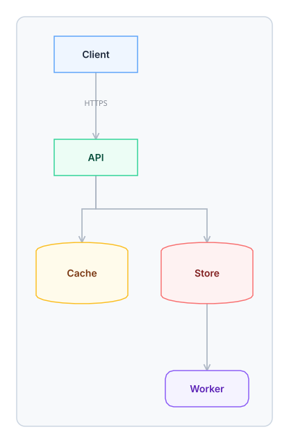

# OpenFlowKit

A free, local-first, agent-native infinite canvas for technical diagrams. It **feels**
like FigJam and **thinks** in text: every diagram is plain DSL you can diff and regenerate,
and agents (MCP or your own key) edit the same document you do.

[](https://github.com/Vrun-design/openflowkit/actions/workflows/quality.yml)
[](LICENSE)
[](CHANGELOG.md)

**2.0 is a rebuild, not an upgrade** — new canvas, new document model, new language,
new agent surface. What changed and why: [CHANGELOG.md](CHANGELOG.md).

- **Canvas that keeps up.** Pixi/WebGL renderer, zoom-to-cursor, connectors that bind to
  sides and never leave a stale route, one undo step per intent.
- **Diagram as code.** Eight diagram families — flowchart, architecture, sequence, state,
  ERD, class, gitgraph, mindmap — plus charts and wireframes, behind one forgiving
  line-oriented DSL, with a deterministic serializer and one canonical form:
  `format(format(x)) == format(x)`.
- **Agents are first-class.** An MCP server drives the *live* editor through a local
  bridge, or works on `.openflow.json` files. Bring your own key for generation inside
  the app. No account, no telemetry; share links are opt-in and end-to-end encrypted.

## The 30 seconds that explain it

```
flowchart
  Client [blue] -> "API Gateway" [emerald] : HTTPS
  "API Gateway" -> Queue [queue, amber]
  Queue -> Worker
  Worker -> Store [cylinder, red, bold]
```

1. Press <kbd>⌥C</kbd>, paste that, press <kbd>⌘↵</kbd> — a real diagram lands as one frame.
2. Drag a node: the code does not change, and the panel says *Canvas edited*.
3. Press <kbd>⌘↵</kbd> again: the frame is replaced from the text, one undo step.
4. Click **Connect agent**, ask your MCP client for `create_diagram` — the same thing
   happens while you watch.
5. Export PNG (2×), SVG, JSON, print-to-PDF, or an animation (animated SVG, GIF, MP4, WebM),
   or **Copy as Mermaid**; switch the palette to `paper`, `builder` or `mono` and regenerate.

## Run it

```bash
npm install
npm run dev              # http://localhost:3000/  → the canvas
npm run typecheck        # tsc -b
npm run lint             # eslint
npm run test -- --run    # vitest (unit + goldens)
npm run verify           # the merge gate: all of the above, MCP tests, headed @gate browser set
```

Requires Node 22.22+. The app is local-first: documents live in your browser (IndexedDB)
with the last-known-good copy kept for crash recovery.

### Self-host

```bash
docker build -t openflowkit .
docker run --rm -p 3045:3045 openflowkit      # http://localhost:3045/
```

The image is the static build behind nginx on port 3045 ([`nginx/nginx.conf`](nginx/nginx.conf),
the same headers as the hosted app). Its CSP decides what the browser may reach:

- `connect-src` allows `https:` (any provider for bring-your-own-key), plus `http://localhost`
  and `http://127.0.0.1` on any port (Ollama, LM Studio, the agent bridge). A plain-`http`
  gateway on another host, such as `http://10.0.0.5:11434`, is blocked: put it behind HTTPS or
  edit the CSP.
- Share links need a Turnstile site key at build time (`VITE_TURNSTILE_SITE_KEY`, plus
  `VITE_SHARE_ORIGIN` for your own share Worker; see [`worker/README.md`](worker/README.md)).
  The Dockerfile passes no build variables and copies no `.env` files, so the image hides Share
  unless you add the key (an `ENV` line before `npm run build`).

## Diagram as code

The language is versioned and written down: **[src/dsl/grammar.md](src/dsl/grammar.md)**.
The same text powers the panel, the AI and the MCP tools.

```
%% ofk 1
architecture right
title: Image upload

  Mobile [mobile] -> Gateway [icon: aws/networking-content-delivery-api-gateway]
  Gateway -> Resize [icon: aws/compute-lambda, green]
  Resize -> Bucket [icon: aws/storage-simple-storage-service, cylinder]
```

- Paste Mermaid, Structurizr DSL or D2 into the code panel and press <kbd>⌘⇧M</kbd>: it
  converts, with an honest loss list. Mermaid pasted straight onto the canvas converts and
  draws in place.
- **Copy as Mermaid** (Export panel) writes a flowchart or sequence diagram back out as Mermaid,
  for a README or a wiki that renders it.
- Right-click a frame → **Edit as code** to reopen its source; the serializer only
  rewrites the frame, never the rest of the page.
- Motion is part of the text too: an `animate` block names the steps an export plays, and
  the export writes animated SVG, GIF, MP4 or WebM in your browser.

```openflow
animate build 10s loop {
  step a, b            // reveal these nodes together
  step a -> c : POST   // a step about the edge a -> c
  step c hold 2s
}
```



## Map a repo

Press <kbd>M</kbd> (or the **Canvas | Map** switch in the document bar) to browse a document's
architecture model as boxes that open in place: **Top level**, **One level in** or **All levels**,
click or <kbd>Enter</kbd> to open a box, arrows to walk, <kbd>Esc</kbd> to back out.

Paste a GitHub address into **Map a GitHub repo** on the empty canvas, or open
`#/map/github/<owner>/<repo>`. `owner/repo`, `github.com/owner/repo` (with or without `https://`
or `www.`), `/tree/` and `/blob/` links, `.git` and `git@github.com:` remotes all work. Your
browser reads the public repo straight from GitHub and draws its parts; every arrow lists the
`file:line` evidence behind it, linked to GitHub. **Edit as drawing** (<kbd>⇧M</kbd>) turns the
map into an ordinary page. `#/from/github/<owner>/<repo>` opens the same repo as an editable C4
model instead, its evidence links pinned to the commit it read.

It reads best on repos with Dockerfiles, compose, Kubernetes, Terraform or Workers configs.
Without a token GitHub allows 60 reads an hour per network; when that runs out the page asks for
an optional token (kept in the tab's sessionStorage, sent to `api.github.com` only). For a private repo, map a
checkout: `npx -p @vrun-design/openflowkit-mcp openflowkit map . --html map.html`. More:
[Map mode and repo maps](docs-site/src/content/docs/map-mode.md).

## Agents

### MCP server

```jsonc
// Claude Code, Claude Desktop, Cursor, Windsurf… — no key, no cloud
{
  "mcpServers": {
    "openflowkit": { "command": "npx", "args": ["-y", "@vrun-design/openflowkit-mcp"] }
  }
}
```

Two modes, one tool surface:

- **Live** — click **Connect agent** in the app; the MCP server pairs with the open
  editor over `127.0.0.1:43119` (Host- and origin-checked; the panel's copied config carries a
  pairing token as `OPENFLOWKIT_BRIDGE_TOKEN`). Tools act on the document you are looking at,
  and `screenshot` returns a real PNG.
- **File** — `openflow_open` a `.openflow.json`, edit it, `openflow_save` it back.

29 tools. Sixteen are editor ops: `create_diagram`, `update_diagram`, `get_diagram`
(text + drift + losses), `list_diagrams`, `get_syntax`, `search_icons`, `find_icons_for`,
`move`, `style`, `delete`, `add_shape`, `export`, `screenshot`, `fit_view`, `get_document`,
`list_pages` (page-scoped ones take a `pageId`). Thirteen work on files and repos:
`openflow_create`, `openflow_open`, `openflow_save`, `whoami`, `server_info`,
`validate_openflow_dsl`, `list_diagram_node_types`, `list_starter_templates`,
`get_starter_template`, `analyze_codebase`, `discover_architecture`, `drift_report`,
`explain_element`. The op manifest lives in [`src/agent/manifest.ts`](src/agent/manifest.ts);
every op is one reversible command, so an agent's edit is one <kbd>⌘Z</kbd>. Node 20.11+.

The same package ships an `openflowkit` CLI for CI and scripts — `render`, `convert`, `validate`,
`op <name>` (any op on a `.openflow.json`), `discover`, `drift`, `build`, `map`:

```bash
npx -p @vrun-design/openflowkit-mcp openflowkit validate diagram.ofk --strict
npx -p @vrun-design/openflowkit-mcp openflowkit drift . --model architecture.ofk
```

### Diagrams in pull requests

The PR diagrams Action comments on a pull request with how its diagrams changed: node and
connector counts before and after, the DSL diff, drift for `.ofk` models, and a refresh of a
stale committed `.svg`.

```yaml
- uses: actions/checkout@v4
  with: { fetch-depth: 0 }
- uses: Vrun-design/openflowkit/action@<tag>
```

`<tag>` must be a release tag on `main` that contains `action/`. Inputs, permissions, forks and
branch protection: [action/README.md](action/README.md).

### Bring your own key

AI assistant (<kbd>⌘J</kbd>) → pick a provider and paste its key: Claude, OpenAI, Gemini, Groq,
Mistral, Cerebras, NVIDIA, OpenRouter, Ollama, or any OpenAI-compatible endpoint (LM Studio…).
The key stays in this browser; the
grammar cheat-sheet and the current frame's text go to the provider you chose, and the
reply arrives as a **proposal** you review before it lands.

## Keyboard

Every action has a key, and <kbd>?</kbd> lists them all in the app (kept honest by
`v2Shortcuts.test.ts`). The ones you will use first: <kbd>V</kbd>/<kbd>R</kbd>/<kbd>O</kbd>/<kbd>T</kbd>
tools · <kbd>⌘↵</kbd> generate · <kbd>⌥C</kbd> code panel · <kbd>⌘J</kbd> assistant ·
<kbd>M</kbd> Canvas / Map · <kbd>⌘F</kbd> find ·
<kbd>⌘0</kbd> fit · <kbd>⇧2</kbd> zoom to selection · <kbd>⌘G</kbd> group ·
<kbd>⌘D</kbd> duplicate · <kbd>Enter</kbd> edit label.

## Repository

| Path | What |
|---|---|
| `src/opencanvas/` | the kernel: pure domain, sessions, Pixi renderer, export/import |
| `src/dsl/` | grammar, parser, families, compile/serialize, fixtures |
| `src/agent/` | op registry, MCP bridge protocol, file host, manifest |
| `mcp-server/` | the published MCP server and `openflowkit` CLI (`@vrun-design/openflowkit-mcp`) |
| `action/` | the PR diagrams GitHub Action |
| `worker/` | the share-link Worker (stores ciphertext only) |
| `docs-site/` | the docs site (Astro Starlight) |
| `STATE.md` | what is done, what is next, what is deliberately deferred |
| `CHANGELOG.md` | what shipped in each version |

Built in slices with one rule: **the app must boot after every merge.** Methodology and
code rules live in [AGENTS.md](AGENTS.md).

## Contributing & license

Issues and PRs welcome — start with [CONTRIBUTING.md](CONTRIBUTING.md). MIT licensed;
see [LICENSE](LICENSE). Security notes: [SECURITY.md](SECURITY.md).
