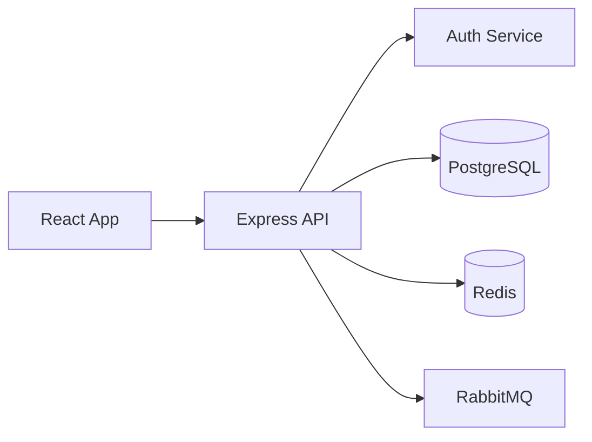

# Reddit Post Strategy For OpenFlowKit

## Goal

Use Reddit to get more builders, engineers, founders, and technical creators to try OpenFlowKit by leading with a concrete visual hook:

> Turn Mermaid, architecture notes, or AI prompts into editable diagrams, then export them as cinematic videos for docs, demos, launch posts, and technical storytelling.

Reddit should not be treated like Twitter. Twitter rewards short claims. Reddit rewards proof, usefulness, specificity, and transparent founder/building-in-public context.

## Core Positioning

### One-line pitch

OpenFlowKit is an open-source, local-first diagramming studio that turns code, Mermaid, imports, and AI prompts into editable diagrams, with export to PNG, SVG, JSON, Mermaid, PlantUML, Figma, and cinematic video.

### Reddit-friendly version

I built an open-source diagramming tool for people who are tired of static Mermaid screenshots and cloud-locked diagram tools. You can paste Mermaid or describe a system with AI, edit it visually, and export an animated diagram for docs, changelogs, demos, or social posts.

### Strongest differentiators

- Animated diagram export is the hook.
- Mermaid import plus visual editing solves an existing developer pain.
- Local-first and no signup reduces Reddit skepticism.
- Open source makes it welcome in developer communities.
- AI is optional and BYOK, so privacy-sensitive users do not feel boxed in.
- Auto-icon assignment for AWS, Azure, GCP, CNCF, and developer tools makes outputs look polished fast.

## Who To Target

### Primary users

- Software engineers writing architecture docs
- Indie hackers and founders explaining product flows
- DevRel teams making tutorials and changelogs
- Technical writers maintaining README and docs diagrams
- SRE, platform, and cloud engineers explaining infra
- Students and interview candidates preparing system-design visuals

### What they want

- Better docs visuals without spending hours in Figma
- Diagram updates that do not become stale instantly
- Shareable short videos for demos and launch posts
- Mermaid compatibility with a real editor
- Architecture icons without manual drag-and-drop
- A tool that does not require uploading internal system diagrams

## Feature Ideas That Can Sell

These are product and content angles worth building around because they create visible Reddit demos.

| Idea | Why it sells on Reddit | Demo asset |
| --- | --- | --- |
| Mermaid to animated video | Developers already use Mermaid, but screenshots are boring | Before Mermaid text, after animated diagram |
| AI prompt to animated architecture walkthrough | Easy wow moment for builders and founders | Prompt, generated diagram, exported video |
| GitHub README animated diagram export | Directly useful for open-source maintainers | README snippet with linked video preview |
| System-design interview mode | High demand, easy to understand | Load balancer to cache to DB animated flow |
| Architecture changelog animation | Shows system evolution over time | v1 to v2 migration animation |
| Incident timeline diagram | Useful for postmortems | Sequence or timeline-style flow |
| API request lifecycle animation | Great for tutorials | Browser to gateway to service to DB |
| Cloud architecture icon auto-assignment | Visually satisfying and technical | Mermaid with Lambda/SQS/DynamoDB becoming icons |
| Figma handoff from engineering diagrams | Useful for product/design collaboration | Export to editable Figma/SVG |
| Local-first private architecture diagrams | Trust angle for teams | No signup, no server storage proof |

## Subreddit Map

Always read recent posts and subreddit rules before posting. Some communities dislike launches, but welcome “I built this because…” posts, technical writeups, or Show HN-style demos.

| Subreddit | Angle | Post type | Risk |
| --- | --- | --- | --- |
| r/programming | Open-source technical launch, Mermaid workflow | Demo plus architecture details | High moderation |
| r/webdev | Tool for docs, architecture, client explainers | Practical workflow | Medium |
| r/devops | Cloud architecture diagrams, incident flows | Infra-focused demo | Medium |
| r/selfhosted | Local-first, no account, privacy | Privacy and local data angle | Medium |
| r/opensource | MIT-licensed project | Project showcase and contributor ask | Low-medium |
| r/SideProject | Founder/building story | Demo and feedback request | Low |
| r/indiehackers | Growth/product angle | What I built and why | Low |
| r/SaaS | Explaining SaaS flows, onboarding docs | Founder utility | Medium |
| r/startups | Investor/customer explainers | Use-case story | Medium |
| r/ProductManagement | User journeys, product flows | Workflow explanation | Medium |
| r/technicalwriting | Docs diagrams and stale docs problem | Deep practical post | Low-medium |
| r/learnprogramming | Explaining systems visually | Educational examples | Medium |
| r/coding | Simple demo | Visual showcase | Medium |
| r/reactjs | React app architecture and implementation | Technical build post | Medium-high |
| r/typescript | TypeScript implementation lessons | Engineering post | Medium-high |
| r/aws | AWS architecture diagrams with icons | Cloud-specific example | High |
| r/kubernetes | K8s/service topology diagrams | Infra-specific example | High |
| r/LocalLLaMA | BYOK/custom OpenAI-compatible AI diagram generation | AI workflow, not spam | Medium |

## Posting Principles

### Do

- Lead with a real short video.
- Mention open source and no signup early.
- Show the exact input and output.
- Ask for feedback on a specific workflow.
- Be transparent that you are the builder.
- Share implementation details when the community is technical.
- Reply deeply to comments for the first 24 hours.
- Post fewer, better posts instead of blasting many subreddits.

### Avoid

- Marketing language like “revolutionary,” “game changer,” or “10x.”
- Posting the same title/body everywhere.
- Dropping only a link.
- Asking for upvotes.
- Over-centering AI when the subreddit is skeptical.
- Sounding like an ad for a SaaS product.
- Hiding that you built it.

## Asset Checklist

Every serious Reddit post should include at least one strong asset.

- 8-15 second video showing the full transformation
- Static before/after image
- Short Mermaid input snippet
- Link to the live app
- Link to GitHub
- One sentence saying “no signup, runs local-first”
- Optional: 30-60 second Loom-style walkthrough

## Demo Concepts

### Demo 1: Mermaid to animated architecture

Input:



Asset:

- First frame: plain Mermaid text
- Middle: OpenFlowKit visual canvas with icons
- End: exported cinematic video

Hook:

> I got tired of pasting Mermaid screenshots into docs, so I built a tool that turns Mermaid into editable diagrams and animated exports.

### Demo 2: AI prompt to system diagram

Prompt:

```text
Create an architecture diagram for a SaaS app with React, API Gateway,
auth service, billing service, PostgreSQL, Redis, S3, and a background worker.
```

Asset:

- Prompt in the AI panel
- Generated diagram
- Export menu with animated export
- Final video

Hook:

> I wanted AI-generated diagrams that are still editable, local-first, and exportable as video.

### Demo 3: README-ready animated diagram

Asset:

- GitHub README with static diagram
- Replace it with exported OpenFlowKit video
- Show short animation in README context

Hook:

> Static architecture screenshots in READMEs go stale fast. I’m experimenting with animated diagrams that can still be edited from source.

### Demo 4: Architecture changelog

Asset:

- Diagram v1: single API and DB
- Diagram v2: queue, worker, cache, storage
- Animated export explaining the migration

Hook:

> I’m testing animated architecture changelogs: instead of writing “we added Redis and a worker,” show the architecture change in 10 seconds.

### Demo 5: Local-first privacy angle

Asset:

- Open app without signup
- Create internal-looking diagram
- Export locally
- Show settings/API key stays in browser

Hook:

> I did not want to upload architecture diagrams to a cloud diagramming tool, so I built a local-first open-source alternative.

## Post Templates

### r/SideProject

Title options:

- I built an open-source tool that turns Mermaid into animated architecture diagrams
- I made a local-first diagram editor with cinematic video export
- I built a diagramming tool because static Mermaid screenshots were annoying me

Body:

```markdown
Hey folks, I’m building OpenFlowKit, an open-source diagramming studio for technical diagrams.

The part I’m testing hardest right now is animated export: paste Mermaid or generate a diagram with AI, edit it visually, then export a video for docs, demos, changelogs, or launch posts.

Why I built it:
- Mermaid is great, but code-only diagrams are hard to polish visually.
- Cloud diagram tools are powerful, but feel heavy for quick technical docs.
- Static screenshots do not explain change over time very well.

What it does today:
- Mermaid import across multiple diagram families
- Visual canvas editing
- Auto icons for developer/cloud tools
- Local-first storage
- No signup
- Exports to PNG, SVG, JSON, Mermaid, PlantUML, Figma, and cinematic video

I’d love feedback on the animated export workflow specifically:
Would you use animated diagrams in READMEs, docs, changelogs, or launch posts?
```

### r/webdev

Title options:

- I built a visual editor for Mermaid diagrams with animated export
- Turning Mermaid into editable architecture diagrams and videos
- Open-source tool for making better architecture diagrams from Mermaid

Body:

```markdown
I’ve been working on OpenFlowKit, an open-source diagramming tool for web/dev architecture docs.

The workflow:
1. Paste Mermaid or describe a system with AI
2. OpenFlowKit turns it into an editable canvas diagram
3. It auto-assigns icons for tools like React, PostgreSQL, Redis, AWS, etc.
4. Export as PNG/SVG for docs, JSON/Mermaid for source, or video for demos

The thing I’m most curious about: animated diagram export.

For example, instead of a static “React -> API -> Postgres” screenshot, you can export a short animation showing the request flow. I’m thinking this could be useful for README docs, onboarding docs, release notes, and technical blog posts.

It’s local-first and does not require signup. AI is optional/BYOK.

Would animated architecture diagrams be useful in your docs, or does static PNG/SVG still cover most needs?
```

### r/devops

Title options:

- Would animated infra diagrams be useful for postmortems and architecture docs?
- I built a local-first architecture diagram tool with animated export
- Open-source Mermaid-to-cloud-architecture editor with video export

Body:

```markdown
I’m building OpenFlowKit, an open-source local-first diagramming tool, and I’m looking for feedback from people who maintain infra docs.

The workflow I’m exploring:
- Paste Mermaid or describe the system
- Convert it into an editable architecture diagram
- Auto-assign cloud/developer icons
- Export PNG/SVG for docs or cinematic video for walkthroughs

Use cases I’m considering:
- incident timelines
- request lifecycle diagrams
- architecture changelogs
- onboarding docs for new engineers
- postmortem visuals

It stores diagrams locally, does not require signup, and exports JSON/Mermaid so the diagram can stay versionable.

Question: for DevOps/SRE docs, would animated exports actually help explain systems, or would they be noise?
```

### r/opensource

Title options:

- OpenFlowKit: open-source local-first diagramming with animated export
- I’m building an MIT-licensed diagram studio for Mermaid, AI, and animated exports
- Open-source alternative for editable technical diagrams and cinematic exports

Body:

```markdown
I’m building OpenFlowKit, an MIT-licensed diagramming studio for technical diagrams.

It combines:
- Mermaid import
- visual canvas editing
- local-first storage
- optional BYOK AI generation
- auto-assigned developer/cloud icons
- exports to PNG, SVG, JSON, Mermaid, PlantUML, Figma, and cinematic video

The feature I think is most unusual is animated export. The idea is that architecture diagrams, request flows, and changelogs can be shared as short videos instead of static screenshots.

Repo: [link]
App: [link]

I’d appreciate feedback on the roadmap, especially which diagram/export workflows would be most useful for open-source maintainers.
```

### r/technicalwriting

Title options:

- Do animated diagrams belong in technical docs?
- I built a local-first tool for editable docs diagrams and animated exports
- Experiment: Mermaid to editable docs diagrams to video

Body:

```markdown
I’m working on OpenFlowKit, a local-first open-source diagram editor, and I’d love feedback from technical writers.

The problem I’m targeting:
- static screenshots get stale
- Mermaid is maintainable but not always presentation-friendly
- design tools are polished but often disconnected from source

OpenFlowKit lets you paste Mermaid, edit visually, keep JSON/Mermaid as source, and export PNG/SVG for normal docs or cinematic video for walkthroughs.

I’m trying to understand where animated diagrams are actually useful:
- onboarding docs
- API request flows
- release notes
- architecture migrations
- incident reviews

Would this help technical docs, or should animated diagrams stay mostly in demos/social posts?
```

## Comment Reply Bank

Use these as starting points, not copy-paste replies.

### “Why not just use Mermaid?”

Mermaid is great, and OpenFlowKit is not trying to replace it. The goal is to keep Mermaid as an input/output format while adding a visual editing layer, icon assignment, and export options like SVG, Figma, and video.

### “Is this cloud-hosted?”

The app is local-first and does not require signup. Diagram data stays in the browser unless you explicitly export or share it. AI is optional and uses your own provider key.

### “Can I version diagrams?”

Yes. The best pattern is to keep Mermaid/OpenFlow DSL/JSON as the source and export PNG/SVG/video only for presentation.

### “Animated diagrams sound gimmicky.”

That is the risk. The useful cases seem to be where the diagram explains sequence or change: request flows, architecture migrations, incident timelines, onboarding walkthroughs, and launch demos.

### “Is it open source?”

Yes, OpenFlowKit is MIT-licensed.

### “Does it support AWS/Kubernetes/etc. icons?”

It includes developer, AWS, Azure, GCP, and CNCF icon libraries, with automatic icon matching based on node labels.

## Launch Cadence

### Week 1: Feedback, not launch blast

Post to:

- r/SideProject
- r/webdev
- r/technicalwriting

Goal:

- Validate whether animated export resonates.
- Collect objections.
- Find exact language users use.

Assets:

- Mermaid to animated video
- README animated diagram demo

### Week 2: Infrastructure angle

Post to:

- r/devops
- r/selfhosted
- r/opensource

Goal:

- Test local-first and privacy positioning.
- Learn if infra people care about animated postmortem/request-flow diagrams.

Assets:

- cloud architecture icon demo
- local-first/no-signup demo

### Week 3: AI and founder angle

Post to:

- r/indiehackers
- r/SaaS
- r/LocalLLaMA

Goal:

- Test AI prompt to editable diagram.
- Position as content/demo creation for builders.

Assets:

- prompt to architecture diagram
- exported video for launch post

### Week 4: Technical deep dive

Post to:

- r/reactjs
- r/typescript
- r/programming, only if the technical writeup is strong enough

Goal:

- Earn technical credibility.
- Drive GitHub stars and contributors.

Assets:

- architecture of OpenFlowKit itself
- parser/import/export details
- performance or local-first implementation notes

## Metrics To Track

Track per post:

- Subreddit
- Title
- Asset used
- Upvotes
- Comments
- Link clicks
- GitHub stars gained
- App launches
- Docs visits
- Signaled use cases in comments
- Objections repeated by more than one person

Qualitative labels:

- Hook worked
- Asset worked
- Wrong subreddit
- Too marketing-heavy
- Needs deeper technical proof
- Feature request worth building

## Success Criteria

### Good early signal

- 20+ thoughtful comments across the first 3-5 posts
- 50+ GitHub stars from Reddit traffic
- People ask if it supports their diagram workflow
- People share specific examples they would use it for
- At least one subreddit asks for a deeper technical post

### Weak signal

- Comments focus only on “why not Mermaid/draw.io?”
- People do not understand what animated export is for
- Video assets get ignored
- Traffic arrives but does not launch the app

### What to change if weak

- Narrow from “diagram tool” to one workflow, such as “Mermaid to animated README diagrams.”
- Show more before/after proof.
- Put less emphasis on AI.
- Add templates for system design, DevOps, and README diagrams.
- Make export examples downloadable from the website.

## Website And Product Follow-Ups

Reddit traffic will convert better if these exist before posting widely:

- A dedicated page for animated diagram export
- A short gallery of exported video examples
- A “Mermaid to video” workflow page
- A “README architecture diagram generator” page
- A “local-first architecture diagram tool” page
- Example templates for API lifecycle, SaaS architecture, AWS queue worker, incident timeline, and system-design interview
- A one-click “Try this example” button from each template into the app

## Priority Roadmap For Reddit-Led Growth

1. Build or polish animated export examples.
2. Add website page: “Animated Diagram Export.”
3. Add template examples that match Reddit demos.
4. Create 5 short video assets.
5. Post first feedback thread in r/SideProject.
6. Use comments to rewrite the next post.
7. Post technical workflow thread in r/webdev.
8. Post infrastructure/privacy thread in r/devops or r/selfhosted.
9. Turn the best-performing post into a permanent blog/docs page.
10. Reuse the highest-performing videos on Twitter, Product Hunt updates, GitHub README, and docs.

## Best First Post

Start with r/SideProject because it is more forgiving, feedback-friendly, and builder-oriented.

Recommended title:

> I built an open-source tool that turns Mermaid into animated architecture diagrams

Recommended asset:

- 12-second video:
  - Mermaid input
  - visual canvas with icons
  - export menu
  - final animated diagram

Recommended CTA:

> I’d love feedback on whether animated diagrams are actually useful for docs/READMEs, or if this is more useful for demos and launch posts.

This keeps the post honest, specific, and discussion-oriented while still making the product memorable.
